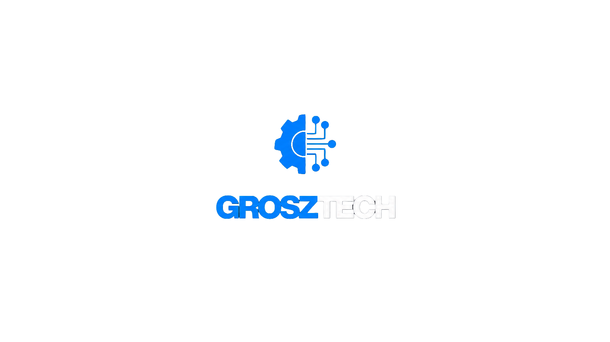

    

<h1 align="center">GroszTech</h1>

    <strong>Tecnologia para todos.</strong>

---

## 📖 Sobre

Este projeto consiste no desenvolvimento do site institucional da **GroszTech**, criado para apresentar a empresa e divulgar o projeto **UniBoard**, um painel alternativo baseado em Arduino para máquinas de lavar.

O site reúne informações sobre a empresa, o projeto, seus diferenciais, o manual do usuário e disponibiliza um formulário de contato.

---

## 🚀 Tecnologias Utilizadas

- HTML5
- CSS3
- JavaScript

---

## ✨ Funcionalidades

- Página inicial com apresentação da empresa;
- Informações sobre o projeto UniBoard;
- Seção de diferenciais;
- Download do Manual do Usuário;
- Formulário de contato;
- Links para redes sociais.

---

## 👨‍💻 Desenvolvido por

**GroszTech**

📍 Mongaguá - SP

📧 contatogrosztech@gmail.com

---

    © 2026 GroszTech • Tecnologia para todos.

